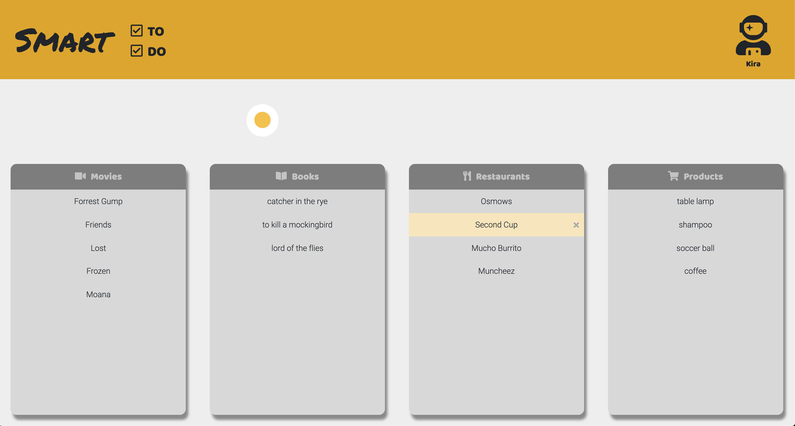
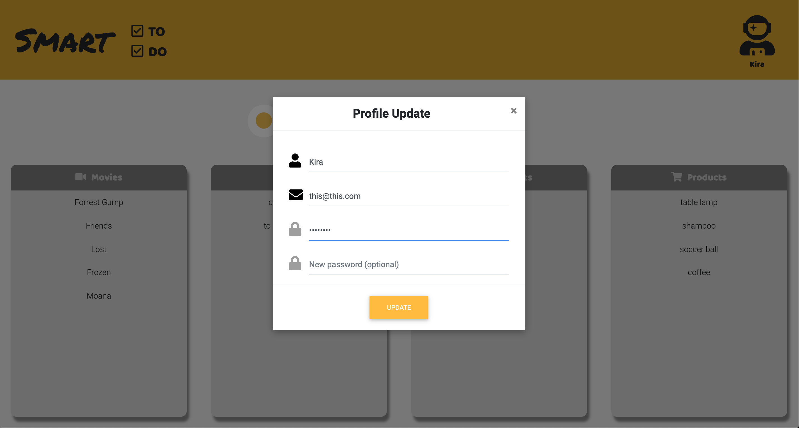

# Smart TO DO List Project

Smart TO DO is an auto-categorize app that let's you save recommendations in Movies, Books, Restaurants and Products.

This repository is the starter code for the project: students had forked and cloned this repository, then built upon it to practice their HTML, CSS, JS, jQuery and AJAX front-end skills, and their Node, Express and PSQL back-end skills.

## Final Product

## Getting Started

1. Fork this repository, then clone your fork of this repository.
2. Install dependencies using the `npm install` command.
3. Start the web server using the `npm run local` command. The app will be served at <http://localhost:8080/>.
4. Go to <http://localhost:8080/> in your browser.
5. You're set to have fun! Enjoy the smart categorization and the lists features and hover details.

## Dependencies

- Express
- Node 5.10.x or above
- Bcrypt
- Body-parser
- Chalk
- Cookie-session
- Dotenv
- Ejs
- Gogle-search-results-serpwow
- Morgan
- Node-sass-middleware
- Pg
- Pg-native
- Sass
